# PlantDisease
Методы машинного обучения в задаче обнаружения и классификации болезней листьев томатов

## Описание базы данных
В проекте используется [Plant Village Dataset], содержащий 6000 отсегментированных изображений больных и здоровых листьев томатов, сбалансированно
разбитый на 6 категорий:

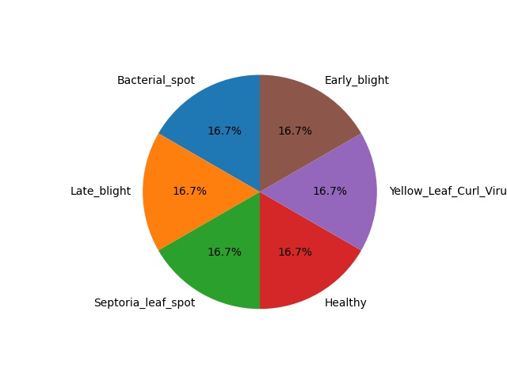
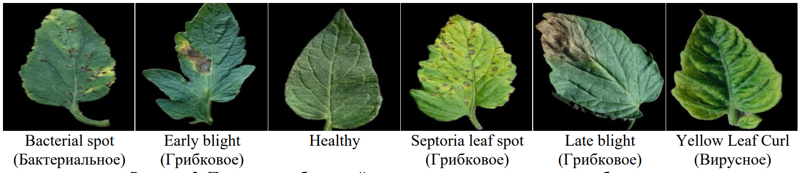

Характеристики изображений:
* Разрешение: 256х256
* Глубина цвета: 8bit
* Формат хранения: .jpeg
* Цветовой профиль: RGB

## Предобработка данных
**1. Удаление черного фона.** Наличие большой черной области сильно искажает сатистические и  тектурные признаки изображения. Обнаружено, что на края листьев и прелегающей области находится много околонулевых писелей - вероятно это эффект предварительной сегментации. Поэтому фоновыми считаются пиксели с интесивностью, меньше 10. Данный порог подобран эмпирически. 
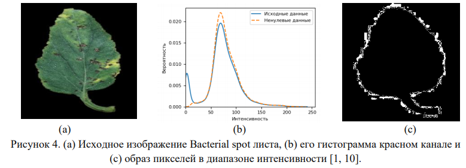

**2. Фильтрация выборки здоровых изображений.** Обнаружено, что выборка здоровых листьев состоит из двух типов изображений – гладкие, равномерно освещенные листья и листья с фактурой и тенью. Для дальнейшего исследования решено оставить те изображения, что ближе к реальности – с фактурой и тенью. Отсеивая все изображения, чьи стандартные отклонения
меньше 30,  будет обрезано распределение по данному признаку. Чтобы этого не допустить добавлена проверка на однородность: HOM > 0.4. Все пороги отсеивания подобраны из вида распределений соответствующего признака.  

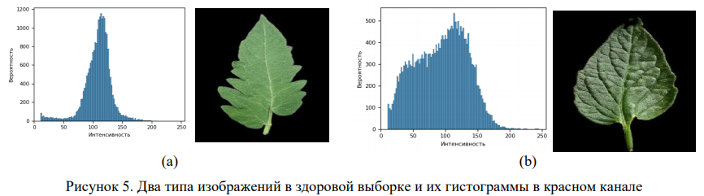  

  

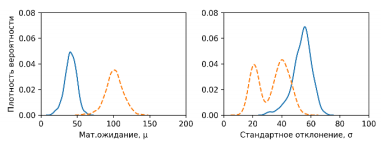
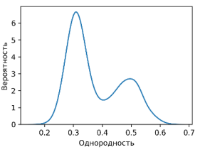

## Выбор источников признаков
В работе рассатиривает два "источника" признаков:  
**1. RED канал RGB изображения.** Пигмент листьев растений, хлорофилл, сильно поглощает видимый свет (от 0,4 до 0,7 мкм) для использования в фотосинтезе. При заболевании образование хлорофилла в листьях нарушается, что приводит к увеличению отражения данных длин волн. Это выражается более явно в красном канале. Поэтому возникает предположение, что признаков, извлеченных из красного канала изображения, окажется достаточно, чтобы с успехом диагностировать заболевание.  
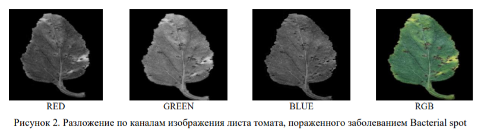

**2. NDVI образы изображений.** [NDVI] – нормализованный вегетационный индекс, по которому можно судить о количестве и качестве растительности. NDVI рассчитыается в красном и инфракрасном диапазоне. Поскольку мы работаем с RGB изображениями, то в чистом виде информации об инфракрасном диапазоне нет. Вместо этого мы обладаем информацией о зеленой области спектра (0.5-0.6 мкм). Так как растения отражают зеленый свет сильнее красного предлагается ввести аналог вегетационного индекса на основе зеленого и красного каналов:

  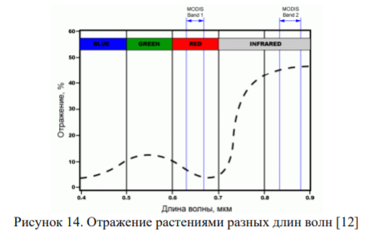
  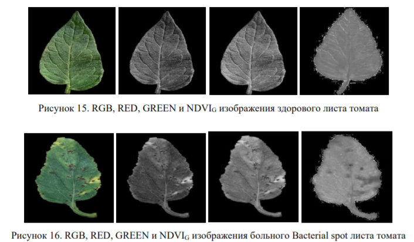

## Извлечение признаков  
**Все признаки извлекались без учета фоновых пикселей**  
Для обучения и тестирования классификаторов из изображений извлекались следующие группы признаков: 
- **STAT**. Статистические характеристики интесивности пикселей изображения: 
&nbsp;&nbsp;&nbsp;&nbsp;&nbsp; &nbsp;&nbsp;&nbsp;&nbsp;&nbsp;

- **HIST**. Бины квантованной гостограммы изображений: 
 &nbsp;&nbsp; 

- **GLCM**. Текстурные признаки изображений на базе матрицы [GLCM]: 
&nbsp;&nbsp;&nbsp;&nbsp;&nbsp;&nbsp;&nbsp;&nbsp;&nbsp;&nbsp; &nbsp;&nbsp;&nbsp;&nbsp;&nbsp;

 Для вычисления GLCM необходимо задать два параметра: *d* - расстояние межде пикселями и *φ* - направление от первого пикселя ко второму. Для выбора оптимальных параметров *d* и *φ*, способных наилучшим образом отделять классы, использовалась информация о косинусном расстоянии между средними векторами глобальных текстурных признаков. Чем меньше угол, тем выше сходство. Для каждого класса вычислен средний вектор глобальных текстурных признаков и найдено среднее значение косинуса с векторами остальных классов при заданной паре параметров (d, φ). 
 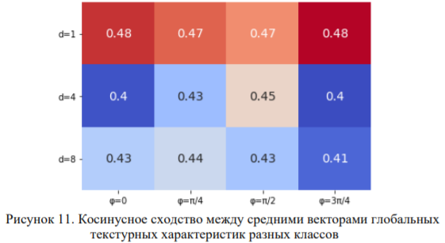
В качестве лучшего расстояния можно выделить d=4. Признаки, рассчитанные при таком значении d, имеют наименьшее косинусное сходство, значит более разнообразно описывают классы. Относительно параметра φ сложно выделить лучшее значение. Поэтому предлагается рассматривать вектора признаков разной длинны:
  - *short* - GLCM признаки для d={4} усредненное по φ={0, π/4, π/2, 3π/4} (всего 5 признаков)
  - *middle* - GLCM признаки для d={4}, φ={0, π/4, π/2, 3π/4} (всего 5 * 4 признака)
  - *long* - GLCM признаки для d={1, 4, 8}, φ={0, π/4, π/2, 3π/4} (всего 5 * 3 * 4 признака)
- **ALL**. Полный вектор признаков {STAT,HIST,GLCM} 

**Все признаки извлекались без учета фоновых пикселей**

## Способы извлечения признаков
Поскольку признаки заболевания растения проявляются в разных областях листа, то для того, чтобы обеспечить устойчивость показаний признаков к пространственному сдвигу,
помимо глобальных признаков, будут рассматриваться и локальные признаки.  
- **global** - признаки, извлеченные неким оператором над всем изображением сразу. 
- **local** - признаки, извлеченные под маской инструмента размером 17х17 пикселей.  
    Алгоритм извлечения локальных призаков:

  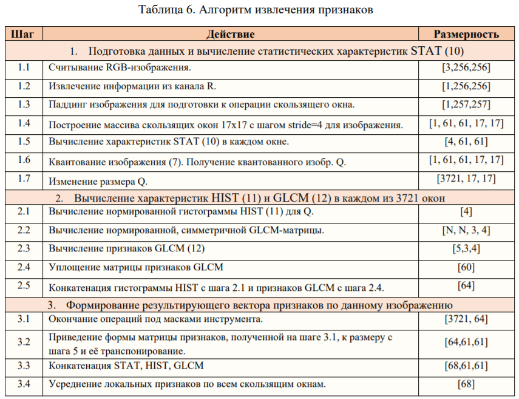

Визуализация локальных признаков: 

  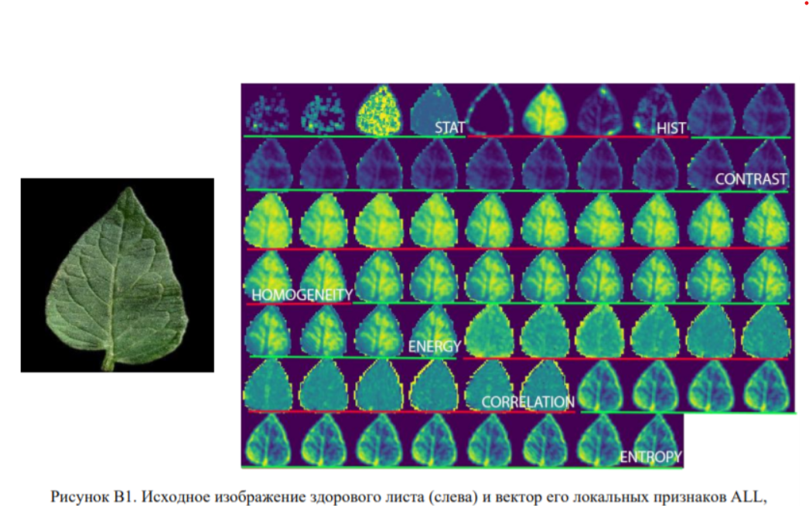
  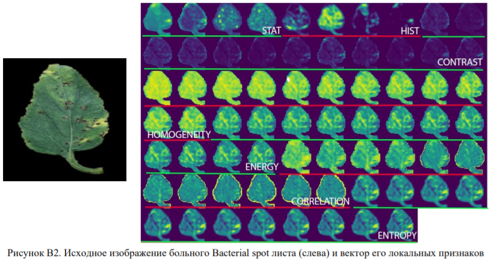

## Классификаторы
Сравнивались возможности следующих классификаторов:  
**1. LDF**   Линейный дискриминант Фишера  
**2. DT**    Дерево решений  
**3. RF**    Случайный лес  
**4. SVM**    Мультиклассовый метод опорных векторов  
**5. KNN**    К-ближайших соседей  
**6. SLP**    Одноуровневый персептрон  
**7. MDT**    Предложен новый алгоритм My Decision Tree для детекции заболевания, работающий только на основе вида распределения тренировочной выборки. Алгоритм работы MDT: 
 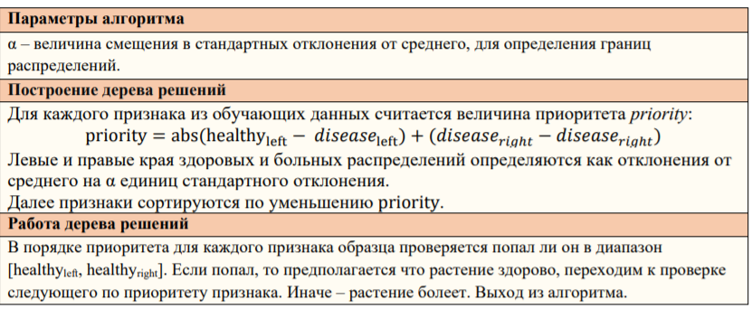 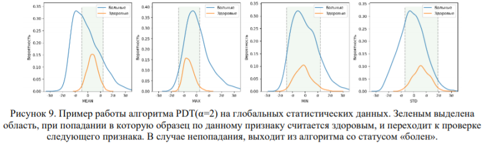 
 Для классификации разработан мультиклассовый алгоритм MDT, который для каждого класса бинарно (по алгоритму выше) определяет вероятность принадлежности этому классу, и в конце выбирает класс с макимальной вероятностью. 

## Подбор гиперпараметров
Оценка параметров моделей проводилась с помощью поиска по сетке с применение kfold валидации (k=5). То есть для каждой конкретной модели брались возможные значения
параметров, и в сетке параметров каждая их комбинация тестировалась k-fold валидацией. В конце выбирался набор параметров, давший наилучший результат при валидации. Валидация
проводилась на полном векторе глобальных признаков ALL.
<table class="tg">
<thead>
  <tr>
    <th class="tg-c3ow">Название метода</th>
    <th class="tg-c3ow">Параметры для scikit-learn</th>
    <th class="tg-0lax" rowspan="8">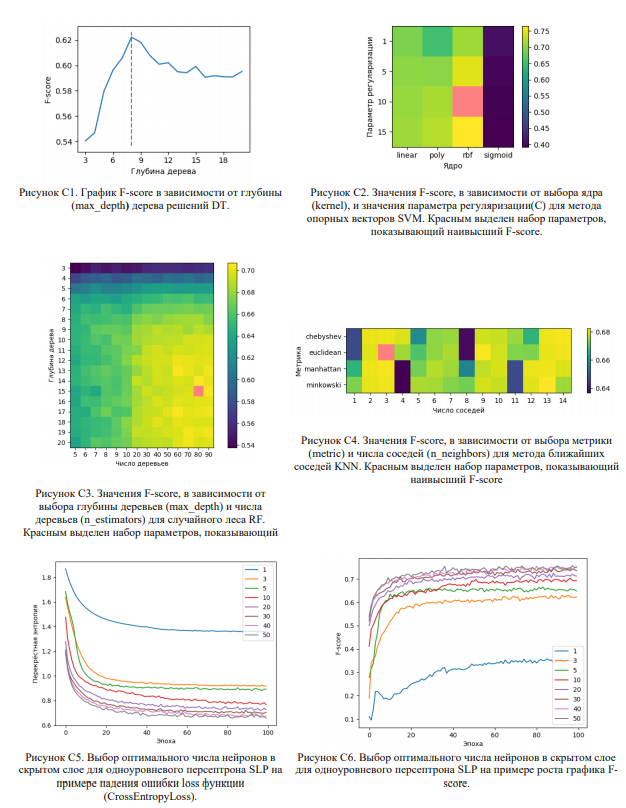</th>
  </tr>
  <tr>
    <td class="tg-c3ow">LDF</td>
    <td class="tg-c3ow">-</td>
  </tr>
  <tr>
    <td class="tg-c3ow">MDT</td>
    <td class="tg-c3ow">alpha=2</td>
  </tr>
  <tr>
    <td class="tg-c3ow">DT</td>
    <td class="tg-c3ow">criterion='entropy', max_depth=9</td>
  </tr>
  <tr>
    <td class="tg-c3ow">KNN</td>
    <td class="tg-c3ow">n_neighbors=3, metric='euclidean', weights=’distance’</td>
  </tr>
  <tr>
    <td class="tg-c3ow">RF</td>
    <td class="tg-c3ow">n_estimators=80, criterion='entropy', max_depth=15</td>
  </tr>
  <tr>
    <td class="tg-c3ow">SVM</td>
    <td class="tg-c3ow">C=10, kernel='rbf', gamma='auto'</td>
  </tr>
  <tr>
    <td class="tg-c3ow">SLP</td>
    <td class="tg-c3ow">hidden_layer_sizes=50, activation=Relu,   loss_function=CrossEntropyLoss, optimizer=Adam,   learning_rate=1.e-3, epoch=100, batch_size=100</td>
  </tr>
</thead>
</table>

## Результаты детектирования 
### RED

  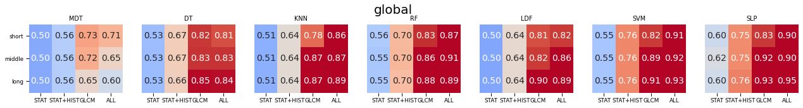
  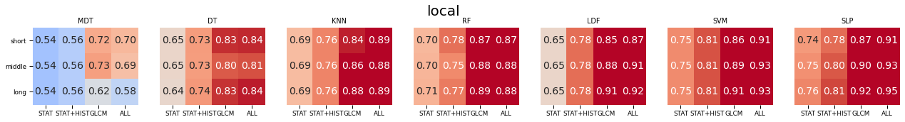

### NDVI

  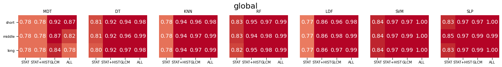
  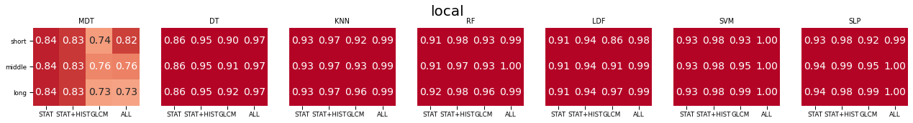

## Результаты классификации 
### RED

  
  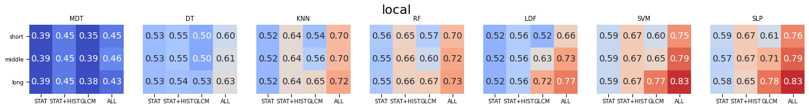

### NDVI

  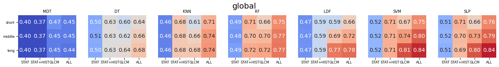
  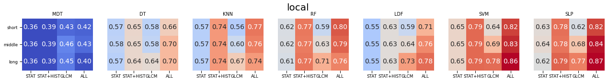

## Описание модулей
* Serialize.py содержит скрипт для сериализации ключевой информации об изображениях в json файл, содержащий: полный путь к изображениям и метку класса.
* Dataset.py содержит операции по доступу к изображениям базы данных.
* Features.py содержит скрипт для извлечения и сохранения признаков изображений.
* Crossval.py содержит скрипт для выполнения кросс-валидации и сохранения классификаторов с лучшим набором параметров.
* Evaluate.py содержит скрипт для тестирования классификаторов.
* Utils.py включает разные функции используемые в других скриптах
* Inference.py содержит скрипт для предсказания класса по изображению.
* Пакет models содержит модули, реализующие следующие классы:
  * features.py – содержит класс Features для извлечения признаков из изображений.
  * slp.py – содержит класс SLP, реализующий модель одноуровневого персептрона.
  * healthyPlant.py – содержит класс HealthyPlant, который реализует сквозной конвейер для классификации болезней растений, от извлечения признаков, до предсказания от классификатора.
  * pdt.py - содержит класс MDT, реализующий модель собственного приоритетного дерева решений

## FIX Результаты
Результаты подробно описаны в [отчете за 2й семестр](materials/reports/report_2_sem.pdf 'отчет'). Реалицация в вектке master.   
Удаление лишних признаков см в [отчете за 3й семестр](materials/reports/report_3_sem.pdf 'отчет'). Реалицация в вектке pca.  
  
## Tools & Docs & Article:
1. [GLCM Texture: A Tutorial]
1. [PyTorch]
1. [Scikit Learn algorithms]
1. [Scikit-image. Greycomatrix]
1. [Scikit-image. Greycoprops]
1. [Plant Village Dataset]
1. [Measuring Vegetation (NDVI & EVI)]
1. [PCA in detail]
1. [PCA understandingly]

## FIX Добавить comb + confus mtx ++ PCA + корреляционный анализ 

[GLCM]: https://prism.ucalgary.ca/bitstream/handle/1880/51900/texture%20tutorial%20v%203_0%20180206.pdf?sequence=11&isAllowed=y
[GLCM Texture: A Tutorial]: https://prism.ucalgary.ca/bitstream/handle/1880/51900/texture%20tutorial%20v%203_0%20180206.pdf?sequence=11&isAllowed=y
[NDVI]:https://earthobservatory.nasa.gov/features/MeasuringVegetation
[PyTorch]: https://pytorch.org/docs/stable/index.html
[Scikit Learn algorithms]: https://scikit-learn.org/stable/modules/classes.html#module-sklearn.tree
[Scikit-image. Greycomatrix]:https://scikit-image.org/docs/dev/api/skimage.feature.html?highlight=skimage%20feature#skimage.feature.greycomatrix
[Scikit-image. Greycoprops]:https://scikit-image.org/docs/dev/api/skimage.feature.html?highlight=skimage%20feature#skimage.feature.greycoprops
[Plant Village Dataset]:https://github.com/spMohanty/PlantVillage-Dataset
[Bacterial spot]:https://www2.ipm.ucanr.edu/agriculture/tomato/bacterial-spot/
[Early blight]:https://www2.ipm.ucanr.edu/agriculture/tomato/Early-Blight/
[Late blight]:https://www2.ipm.ucanr.edu/agriculture/tomato/Late-Blight/
[Yellow Leaf Curl Virus]:https://www2.ipm.ucanr.edu/agriculture/tomato/tomato-yellow-leaf-curl/
[Septoria leaf spot]:http://ipm.ucanr.edu/PMG/GARDEN/PLANTS/DISEASES/septorialfspot.html
[RGB+NIR Extraction From A Single RAW Image]: http://aggregate.org/dit/rgbnir/
[Measuring Vegetation (NDVI & EVI)]:https://www.earthobservatory.nasa.gov/features/MeasuringVegetation
[PCA in detail]:https://e-learning.unn.ru/pluginfile.php/41225/mod_resource/content/4/%2B%2B%20%20%20%20%D0%9B%D0%B5%D0%BA%D1%86%D0%B8%D1%8F%202%20%D0%9C%D0%93%D0%9A.pdf
[PCA understandingly]:https://habr.com/ru/post/304214/
